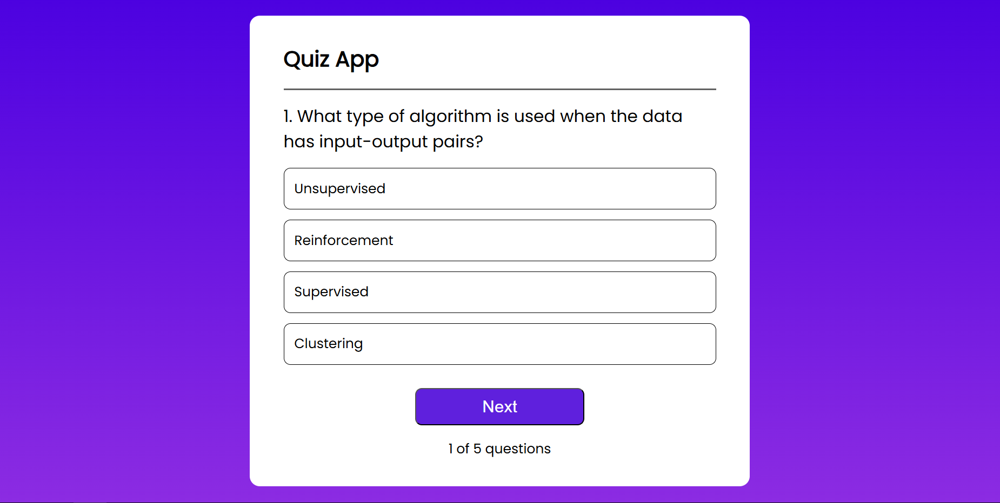
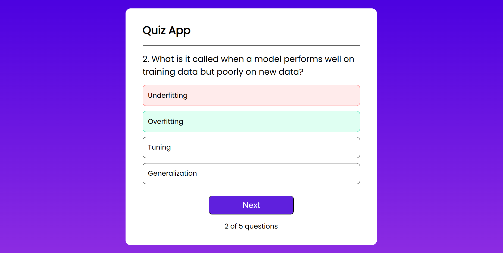
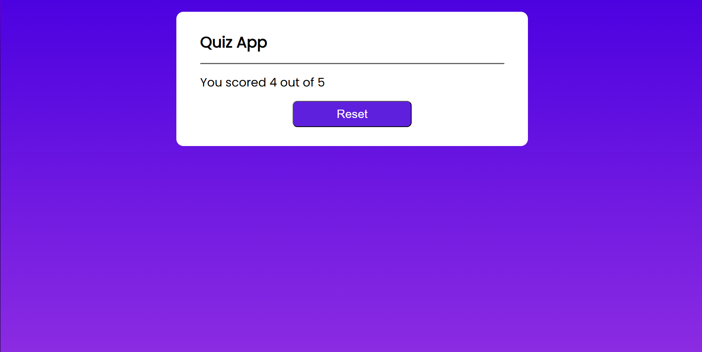

# 🧠 Quiz App

A simple and interactive **Quiz App** built using **React.js** to practice and improve JavaScript logic and frontend skills.

---

## 🚀 Features

- 🎯 Multiple-choice questions
- ✅ Real-time scoring and feedback
- 🔄 Option to restart the quiz
- ⚛️ Built with reusable React components
- 📱 Responsive design for all screen sizes

---

## 💡 Purpose

This project was created as a **mini learning project** to:
- Strengthen JavaScript logic-building skills
- Gain hands-on experience with React.js
- Practice component-based architecture and state management

---

## 🛠️ Tech Stack

- **React.js**
- **JavaScript (ES6+)**
- **HTML5**
- **CSS3**

---

## 📸 Preview

Quiz App:



---

## 🔗 Demo Screenshots

Option Selecting:



Result:



---

## 📂 How to Run Locally

1. Clone the repository  
   ```bash
   git clone https://github.com/aryandas2911/Quiz-App.git
   cd quiz-app
   npm install
   npm start
The app should now be running on http://localhost:3000 🎉

---

## 🙌 Feedback

I'm constantly learning and open to suggestions!
Feel free to open an issue or submit a PR with improvements.

